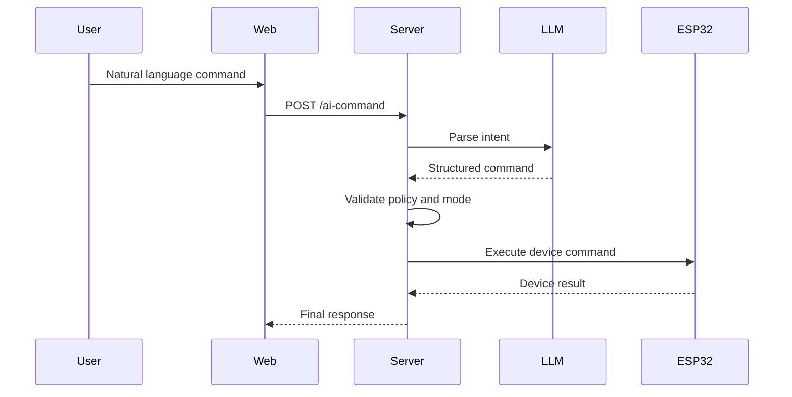

# AI Command Workflow

## 1. AI Control Flow (User → LLM → ESP32)

### Process

1. User submits a natural language command from the Web UI.
2. Web calls `POST /api/v1/ai-command`.
3. Server builds a prompt using the current context (mode, device state, room).
4. Server sends the prompt to the LLM for intent parsing.
5. Server validates the parsed command:

   * Matches the required schema
   * Uses valid devices and actions
   * Complies with auto/manual mode rules
6. Server maps the command to the corresponding ESP32 endpoint.
7. Server executes the command on ESP32.
8. Server returns the final result to the Web UI.

### Flow Diagram

## 2. Error Handling & Fallback

* LLM timeout → Retry once.
* Invalid LLM output schema → Return `ERR_AI_PARSE_FAILED`.
* ESP32 timeout → Retry up to 2 times.
* If execution still fails → Suggest using `POST /control` manually.

## 3. Timeout Strategy

| Request Path   | Timeout | Retry |
| -------------- | ------- | ----- |
| Web → Server   | 8s      | None  |
| Server → LLM   | 4s      | 1     |
| Server → ESP32 | 1.5s    | 2     |

## 4. User Confirmation Rules

Confirmation is required when:

1. The command is ambiguous and the target room/device is unclear.
2. A lock/unlock action conflicts with the current automation mode.
3. The LLM confidence score is below the configured threshold.
