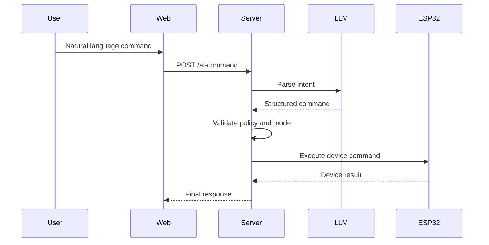

# AI Command Workflow

## 1) AI control flow (User -> LLM -> ESP32)

### Step-by-step
1. User nhap cau lenh tu nhien tren Web
2. Web goi `POST /api/v1/ai-command`
3. Server tao prompt co context hien tai (mode, device state, room)
4. Server goi LLM de parse command
5. Server validate command parse ra:
   - dung schema
   - dung device/action
   - khong vi pham rule auto/manual
6. Server map command thanh endpoint ESP32 tuong ung
7. Server goi ESP32 va nhan ket qua
8. Server tra ket qua tong hop ve Web

### So do nhanh

## 2) Loi va fallback
1. LLM timeout -> retry 1 lan
2. LLM parse sai schema -> tra `ERR_AI_PARSE_FAILED`
3. ESP32 timeout -> retry toi da 2 lan
4. Van that bai -> tra huong dan user dung `POST /control` thu cong

## 3) Timeout strategy trong AI flow
1. Web -> Server: 8s
2. Server -> LLM: 4s, retry 1 lan
3. Server -> ESP32: 1.5s, retry 2 lan

## 4) Dieu kien xac nhan user
1. Lenh mo ho phong/thiet bi can hoi lai
2. Lenh lock open trong mode auto yeu cau xac nhan
3. Lenh confidence thap hon nguong can xac nhan truoc khi execute
