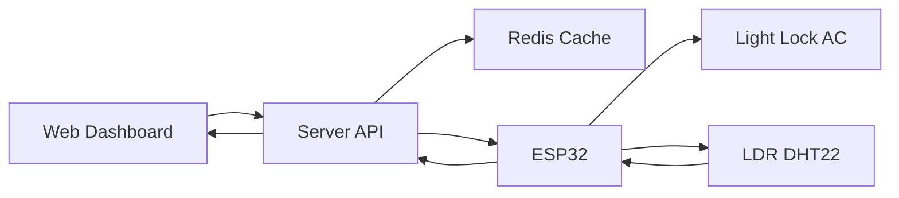
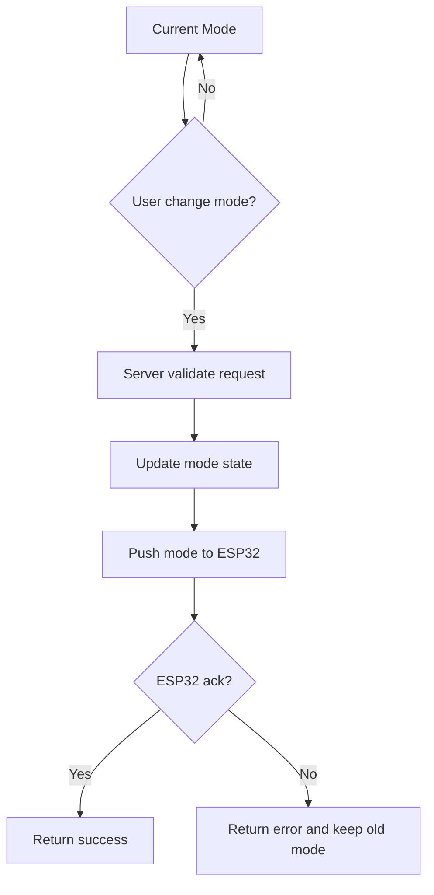

# Smart Home System Workflow

## 1) Tong quan luong he thong

## 2) Auto vs Manual mode switching

### Step-by-step
1. Web gui lenh chuyen mode (`manual` hoac `auto`) len Server
2. Server cap nhat mode hien tai vao state store
3. Server dong bo mode xuong ESP32
4. ESP32 xac nhan mode moi
5. Server tra ket qua ve Web

### Rule uu tien
1. Neu mode `manual`: lenh tu Web duoc uu tien thuc thi ngay
2. Neu mode `auto`: rule sensor duoc uu tien
3. Manual override trong mode `auto` phai co co `override=true`
4. Het han override, he thong quay ve rule auto

### So do chuyen mode

## 3) Checklist trien khai nhanh
1. Bat buoc dong nhat mode giua Web, Server, ESP32
2. Moi lenh control phai kem `request_id`
3. Trang thai cuoi cung luon lay tu ESP32 khi co xung dot
