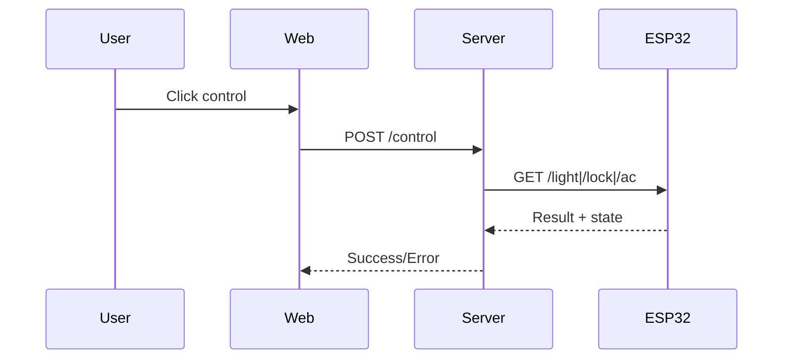
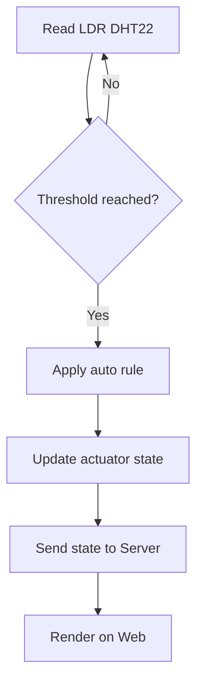

# IoT Workflow

## 1) Manual control flow (Web -> ESP32)

### Step-by-step
1. User bam nut tren Web Dashboard
2. Web goi `POST /api/v1/control` tren Server
3. Server validate payload va mode
4. Server goi ESP32 endpoint:
   - `/light?room=living&state=on`
   - `/lock?state=open`
   - `/ac?state=on`
5. ESP32 dieu khien relay/servo
6. ESP32 tra ket qua ve Server
7. Server cap nhat state va tra response ve Web

### So do nhanh

## 2) Sensor automation flow (LDR, DHT22)

### Step-by-step
1. ESP32 doc `LDR` va `DHT22` theo chu ky
2. ESP32 so sanh voi nguong tu dong
3. Neu vuot nguong, ESP32 ap dung rule:
   - LDR thap -> bat den
   - Nhiet do cao -> bat AC
4. ESP32 cap nhat state noi bo
5. Server goi `GET /sensor` hoac nhan telemetry
6. Server dong bo trang thai cho Web

### So do nhanh

## 3) Rule an toan trong IoT flow
1. Lock co cool-down giua hai lan open/close
2. AC co anti-toggle de tranh dong/ngat qua nhanh
3. Sensor loi lien tiep se tam dung auto rule va bao loi len Server
