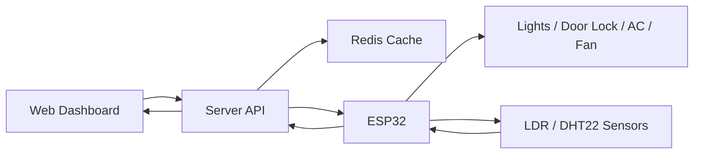

# Smart Home System Workflow

## System Overview

```mermaid
flowchart LR
    A[Web Dashboard] --> B[Server API]
    B --> C[Redis Cache]
    B --> D[ESP32]
    D --> E[Lights / Door Lock / AC / Fan]
    D --> F[LDR / DHT22 Sensors]
    F --> D
    D --> B
    B --> A
```